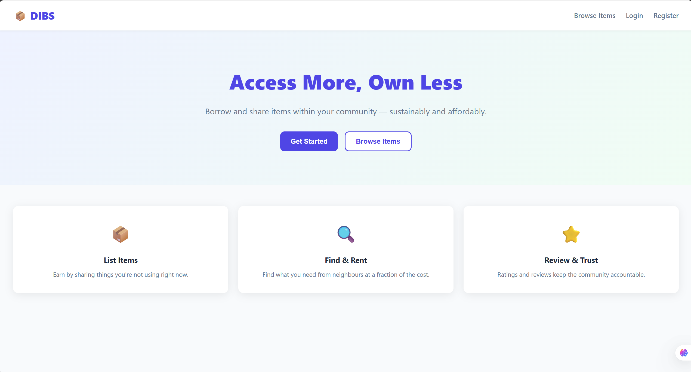
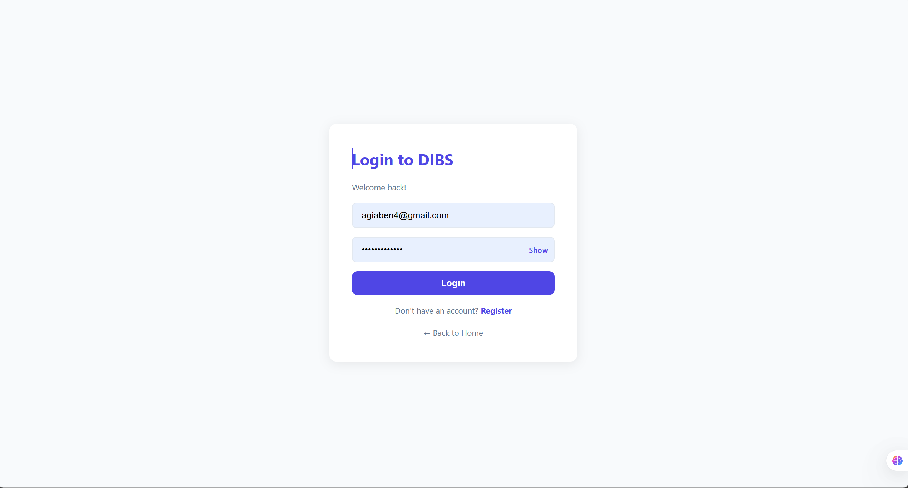
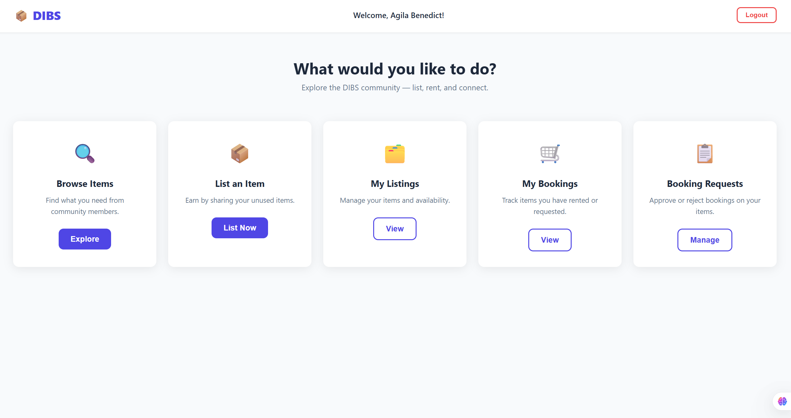
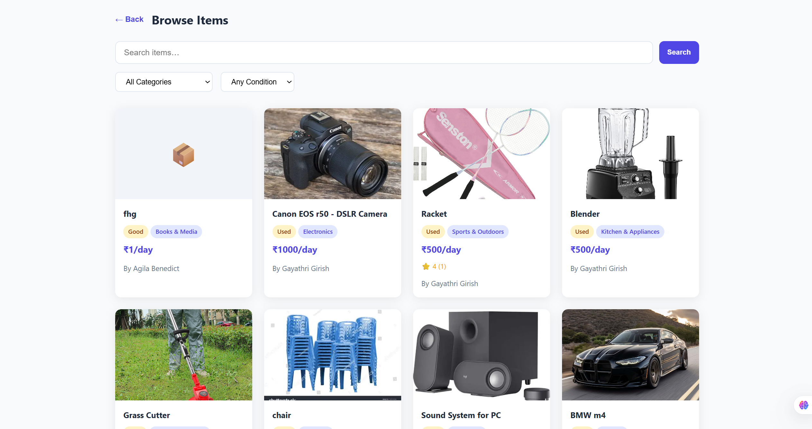
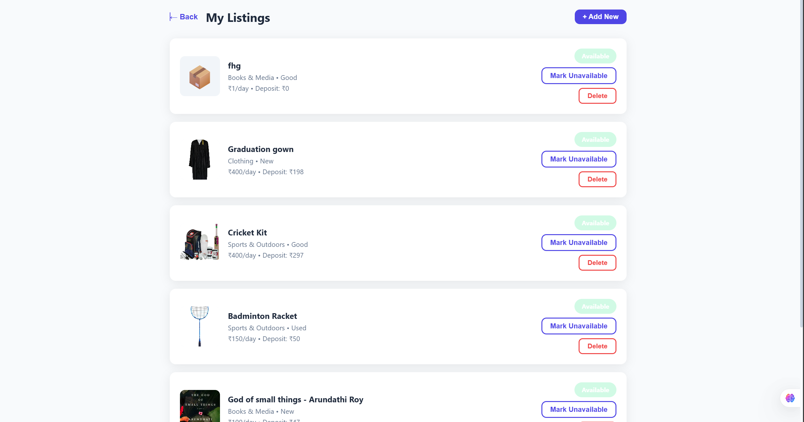
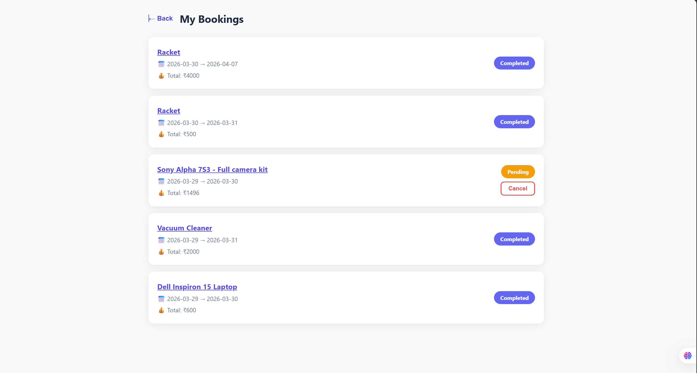

# DIBS

A full-stack rental marketplace where users can list, browse, and book items.

## Tech Stack
- React
- Flask
- MySQL
- JWT Authentication

## Features
- User authentication
- Item listing with images
- Search and filter
- Booking system
- Ratings & reviews

## How to Run

### Backend
cd backend  
pip install -r requirements.txt  
python app.py  

### Frontend
npm install  
npm run dev  

## Screenshots

###Landing Page

### Login Page

### Logged In Home

### Browsing Page

### My Listings

### My Bookings

## Author
Agila Benedict
